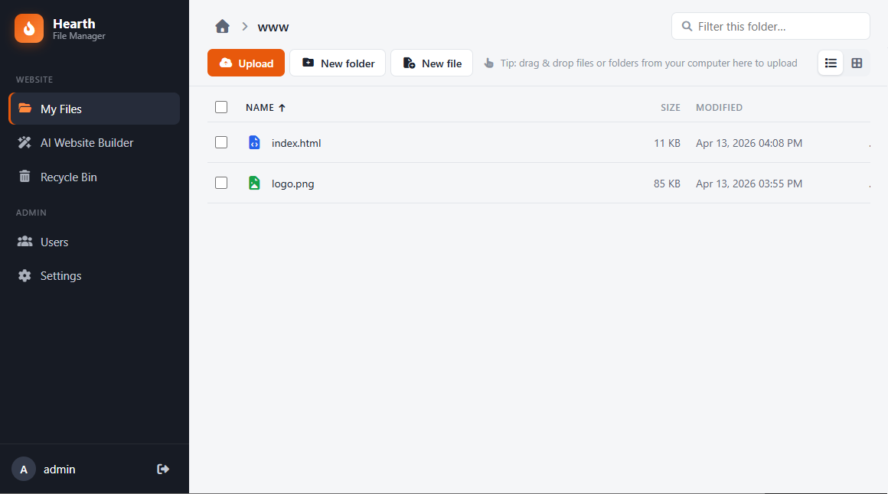
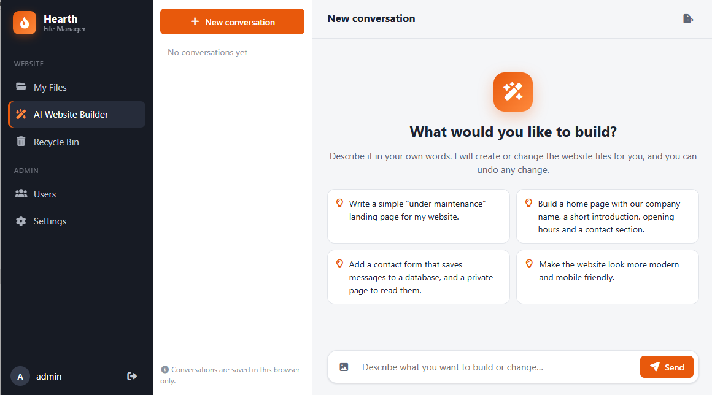
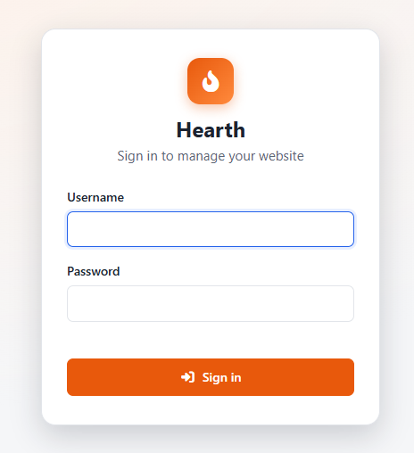

# Hearth File Manager

A web file manager built in **Pageless ASP.NET Web Forms Architecture** with a **Gemini-powered website builder**.

Give a client (or yourself) a friendly place to manage a website's files on an IIS server, and let them build or change the site just by describing it to Gemini, which edits the real files directly on the server.



---

## Features

### File manager
- **Drag & drop upload** of files *and whole folders* from your computer (chunked, with progress; large files supported)
- **Zip / unzip**, plus download of several files at once as a zip
- **Table list view** and **grid view with image thumbnails**, sorting, filtering, image lightbox
- Rename, move, copy, new file / new folder, right-click menu and keyboard shortcuts
- Built-in **text / code editor** (HTML, CSS, JS, PHP…) with line numbers and Ctrl+S
- **Recycle bin**: deleted items can be restored to their original location
- **Multi-user with permissions**: per user, tick *Manage files* (without it the user is view & download only),
  *Use AI website builder*, *Manage settings* and *Manage users*. Everyone can change their own password on *My Account*.
  Lock-out protection: you can't delete yourself or remove your own *Manage users*, and one user must always keep it

### Gemini-powered website builder


- Chat in plain language: *"Write a simple under-maintenance page"*, *"Build a home page with our opening hours and a contact form"*
- Gemini works through built-in tools that operate on the website folder only:
  list files, search text, read files (including **viewing images**), **write files**, **edit files**, create folders, move, delete (to the recycle bin)
- **PHP by default** for server-side logic, with **SQLite** for data (Gemini can create and query databases itself)
- Every change goes **live immediately**, and **every AI reply can be undone** with one click
- **Automatic rate-limit handling**: there is no need to configure your plan. Requests go out at full speed, and
  if Google reports the per-minute limit was reached, Hearth learns that model's limit and slows down
  (e.g. free ≈ 15 RPM, paid Tier 1 ≈ 4,000 RPM for Flash-Lite)
- **Automatic model switching** when a model's daily limit is used up
  (default: Gemini 3.5 Flash-Lite → 3.1 Flash-Lite → Flash models), configurable
- Choose the **default Gemini model** on the Settings page
- **Conversation history is stored in the browser (IndexedDB)**, so nothing is kept on your server except short-lived undo snapshots

> RPM = requests per minute, RPD = requests per day.

---

## How it works: two IIS sites, one folder tree

Hearth is deployed as **two IIS websites** that share one folder:

```
C:\inetpub\hearth\                        ← IIS site #1: Hearth File Manager (the app root)
│   Global.asax, Web.config, bin\, css\, js\, engine\, RH\ ...
│
└── App_Data\                             (never served by IIS)
    ├── config.json                       users (PBKDF2 hashes), Gemini key & settings
    ├── sessions.json, recycle-index.json, ai-undo\, tmp\
    └── wwwroot\                          ← everything Hearth manages
        ├── www\                          ← IIS site #2: the public website (HTML + PHP)
        ├── db\                           ← SQLite databases used by the PHP site (not public)
        └── recycle-bin\                  ← deleted items
```

| Path | Purpose | Served publicly? |
|---|---|---|
| `/` (app root) | Hearth File Manager | Yes, behind a login (e.g. `files.example.com`) |
| `/App_Data/wwwroot/www/` | The client's website, HTML + PHP | Yes, as its own IIS site (e.g. `www.example.com`) |
| `/App_Data/wwwroot/db/` | SQLite files for the website's PHP | No |
| `/App_Data/wwwroot/recycle-bin/` | Deleted files and folders | No |

Because `db/` sits **outside** the public `www/` folder, database files can't be downloaded. PHP reaches them with a relative path:

```php
$pdo = new PDO('sqlite:' . __DIR__ . '/../db/site.db');
```

---

## Requirements

- Windows Server / Windows with **IIS**
- **.NET Framework 4.8**
- **PHP for IIS** (FastCGI) on the second site, if the website uses PHP, with the `pdo_sqlite` extension
- To build: Visual Studio 2019+ (or MSBuild) with NuGet restore
  (`Newtonsoft.Json`, `Stub.System.Data.SQLite.Core.NetFramework`)
- A **Gemini API key** (free tier works) for the website builder

---

## Deployment

1. **Build** the solution in Release and publish/copy the site to the server, e.g. `C:\inetpub\hearth\`.
   Make sure `bin\x86\SQLite.Interop.dll` and `bin\x64\SQLite.Interop.dll` are included.
2. **IIS site #1 – Hearth**
   - Physical path: `C:\inetpub\hearth\`
   - App pool: .NET CLR v4.0, Integrated pipeline
   - Give the app pool identity **Modify** permission on `C:\inetpub\hearth\App_Data\`
   - Bind it to its own host name, e.g. `files.example.com`, with **HTTPS**
3. **IIS site #2 – the public website**
   - Physical path: `C:\inetpub\hearth\App_Data\wwwroot\www\`
   - Enable PHP (FastCGI) and add `index.php` / `index.html` as default documents
   - If PHP writes to SQLite, give this site's app pool identity **Modify** permission on `App_Data\wwwroot\db\`
   - Bind it to the public host name, e.g. `www.example.com`

   The `www`, `db` and `recycle-bin` folders are created automatically on first start.
4. **Sign in** at site #1 with the default account:

   | Username | Password |
   |---|---|
   | `admin` | `admin` |

   **Change this password immediately** on the *Users* page.
5. **Settings page**: paste your Gemini API key, pick a model, and enter the public website address (used for "View website" links).

> **Security note:** `App_Data/config.json` holds password hashes and your Gemini API key. IIS never serves `App_Data`, but keep it out of source control (it's in `.gitignore`).
> Keep `"DevAutoLogin": false` on production. It is a developer convenience that only works for `localhost` requests.

---

## Gemini API key & limits

- Get a key: **https://aistudio.google.com/api-keys**
- See your current limits and usage: **https://aistudio.google.com/rate-limit**

Limits are **per model**. As of October 2026, for example:

| Model | Free tier | Paid Tier 1 |
|---|---|---|
| Gemini 3.5 Flash-Lite | 15 RPM · 500 RPD | 4,000 RPM · 150,000 RPD |
| Gemini 3.x Flash | 5 RPM · 20 RPD | 1,000 RPM · 10,000 RPD |

Google changes these numbers often, so check the link above. Hearth doesn't need to be told your plan: it adapts automatically.
One builder request ("build me a page…") usually takes about 2–6 API requests.

> On the free tier, Google may use your prompts to improve its products.

---

## Architecture (for developers)

Hearth follows the **Pageless ASP.NET Web Forms** pattern: no `.aspx`, no ViewState, no postbacks.

- `Global.asax.cs` routes every request in `Application_BeginRequest` with a `switch`; each feature has a page route (`/files`) and an API route (`/fileapi`)
- **One handler per file** in `RH/` (`FilesPage.cs`, `FilesPageApi.cs`, …), and HTML is composed in C#
- **Core logic has no `HttpContext` dependency** (`engine/FsService.cs`, `engine/Ai/*`), so it can be tested from PowerShell without IIS (see `tests/`)
- Custom cookie sessions (`AppSession`), no ASP.NET session state, no database (JSON config)
- One central JavaScript `Api` scope (`js/site.js`) handles every `fetch`/upload call
- System fonts only, and a **self-hosted Font Awesome**: no external CDN or font downloads

```
engine/            AppConfig, AppSession, Guard, PageTemplate, FsService
engine/Ai/         GeminiAgent (function-calling loop, rate limiter, model fallback),
                   AiTools (tools exposed to Gemini), AiUndo, AiTaskManager
RH/                page + API handlers
js/, css/          site, page and component scripts/styles
js/components/     hearth-editor.js (HearthEditor.open(path)), hearth-store.js (IndexedDB)
tests/             PowerShell scripts that drive the compiled DLL directly
```

More implementation notes: [DEVELOPER-NOTES.md](DEVELOPER-NOTES.md).

---

## Screenshots

| Sign in | File manager | AI website builder |
|---|---|---|
|  |  |  |

---

## License

Released into the public domain under **[The Unlicense](LICENSE)**: use it, change it, sell it, no attribution required.
